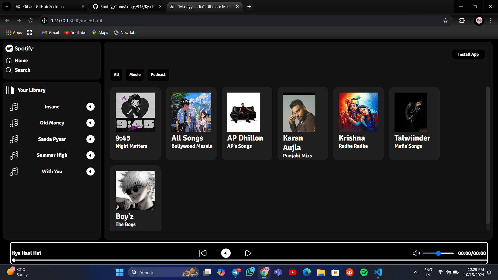
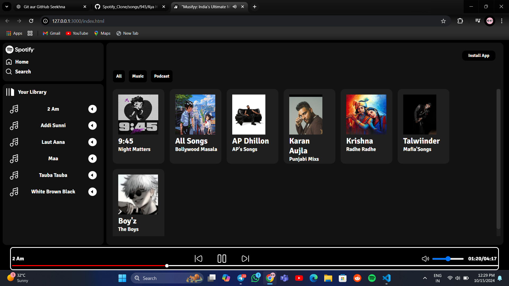

# Musifyy

**Musifyy** is a music streaming frontend project inspired by Spotify. Built with HTML, CSS, and JavaScript, it allows users to listen to their favorite songs.

## Features:
- User-friendly interface to play music.
- Songs available in the "songs" folder.
- Responsive design for mobile and desktop.

## Technologies Used:
- HTML
- CSS
- JavaScript

## Project Screenshots:

## Note:
Due to GitHub Pages' file size limitations, the songs are not playable here. However, you can check out the fully working project on the external live demo link below.

## Live Demo:
[Live Demo Link]( https://lakshy-aa.github.io/Spotify_Clone/)

## How to Run:
1. Clone the repository.
2. Open `index.html` in your browser to start using Musifyy.
